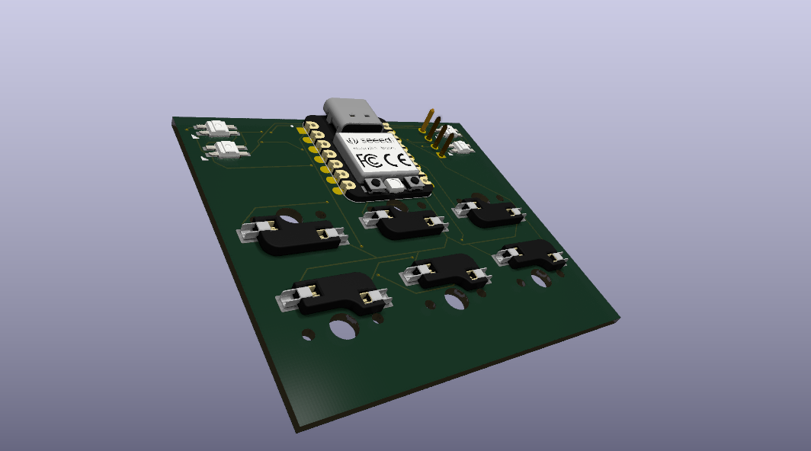
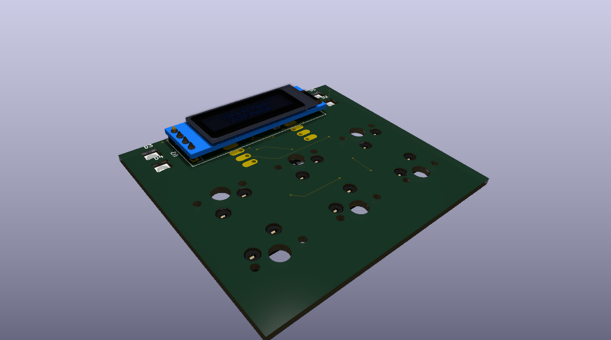
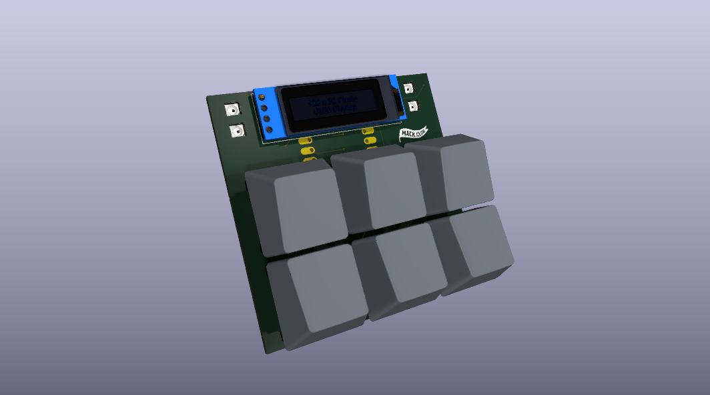
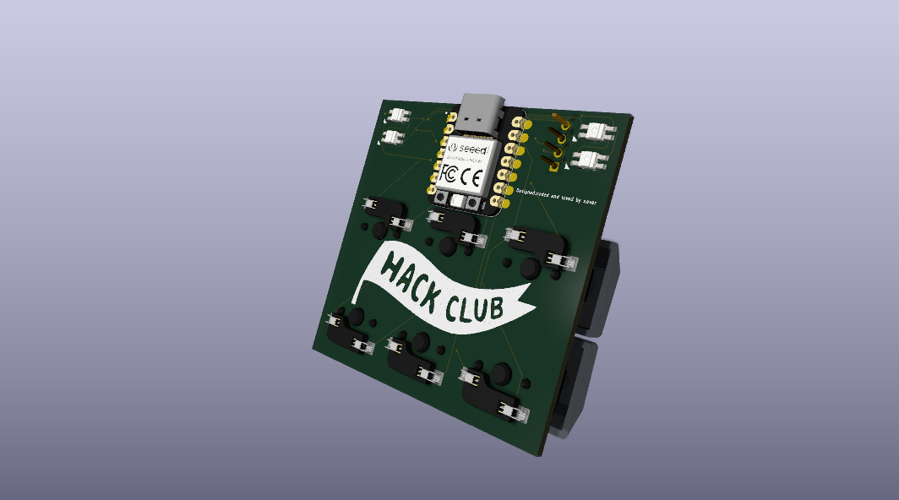

Hello this is my MacroPad Project. The PCB's all messy and dont even talk about the 3d model which ı havent even done and still need to do in the near future. 
V1 of Pad.sh

V2 of Pad.sh

on the V2 placement of the switches are hopefully fixed ı am still seeing some issues but dont know how to fix them i tried making the pcb bigger but still same issue.